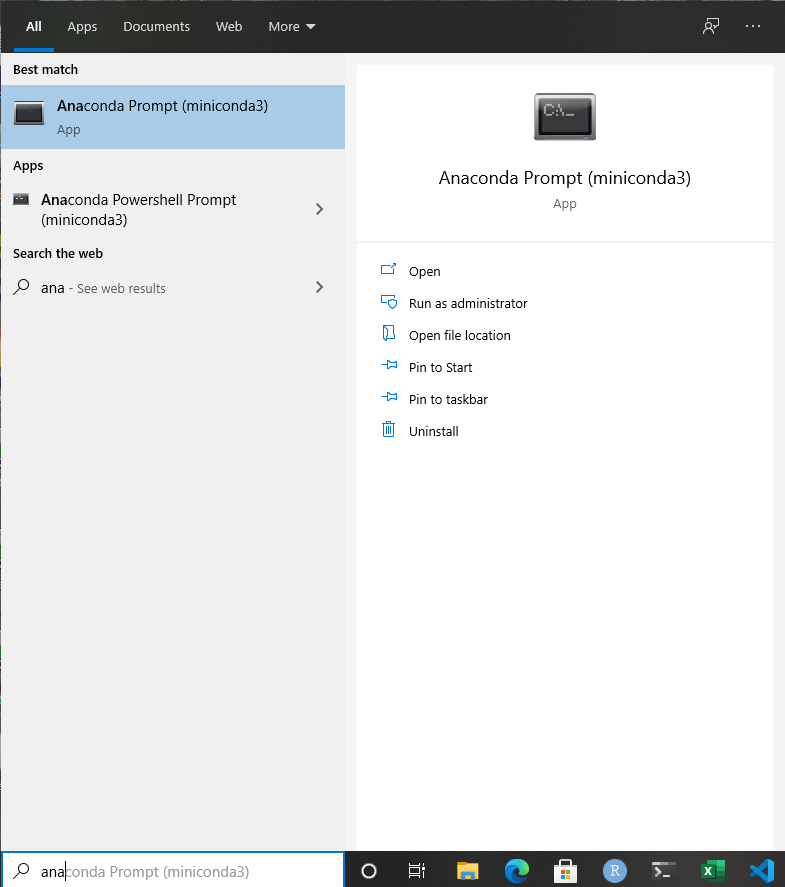

# IDMA Full Time Content Repository

This repo contains the content for IDMA full time program. The repo will remain a work in progress.

## Week 1 (Agenda, Pre-requisites and readings) 

1. **Pre-requisites**

   - Install anaconda on your system. Visit [here](https://www.anaconda.com/products/individual) to download the software.

   - After installation you should be able to see `anaconda prompt` in your search bar 

   - Revise basic ideas of programming such as variables, loops, conditionals.

2. **Readings** (Some resources require Orielly Credentials)

    **Pre-reads**

   - Python 101: [Mark Lutz, Learning Python, 5th Edition, Chapter 4](https://learning.oreilly.com/library/view/learning-python-5th/9781449355722/ch04.html#introducing_python_object_types)
   - Oops for DS:[Mark Lutz, Learning Python, 5th Edition, Chapter 26](https://learning.oreilly.com/library/view/learning-python-5th/9781449355722/ch26.html#oop_colon_the_big_picture)
   - Pandas 101:[Matt Harisson, Pandas 1.x Cookbook, Chapter1](https://learning.oreilly.com/library/view/pandas-1x-cookbook/9781839213106/Text/Chapter_1.xhtml#_idParaDest-11)

    **Post Session Reads**
    - Python 101 [Mark Lutz, Learning Python, 5th Edition, Chapter 10, 13, 14](https://learning.oreilly.com/library/view/learning-python-5th/9781449355722/)
    - Oops for DS: [Mark Lutz, Learning Python, 5th Edition, Chapter 27](https://learning.oreilly.com/library/view/learning-python-5th/9781449355722/ch27.html#class_coding_basics). You can skim through the portion on operator overloading.
    - Pandas 101: [Matt Harisson, Pandas 1.x Cookbook, Chapter2, Chapter3, Chapter4, Chapter5, Chapter6, Chapter7, Chapter9](https://learning.oreilly.com/library/view/pandas-1x-cookbook/9781839213106/) You can complete these readings over a span of 2-3 weeks. As the course progresses you will find yourself using this book as a quick reference.

## Week 2 (Agenda, Pre-requisites and readings)

1. **Pre-requisites**
   - Install [dbeaver])(https://dbeaver.io/download/)

2. **Readings** (Some resources require Orielly Credentials)

    **Pre-reads**

    - Introduction to SQL: SQL Queries for Mere Mortals: A Hands-On Guide to Data Manipulation in SQL, 4th Edition, [Chapter1](https://learning.oreilly.com/library/view/sql-queries-for/9780134858432/ch1.xhtml#ch1)  
    - Window Functions: [AnalyticFunctions](https://oracle-base.com/articles/misc/analytic-functions#syntax)